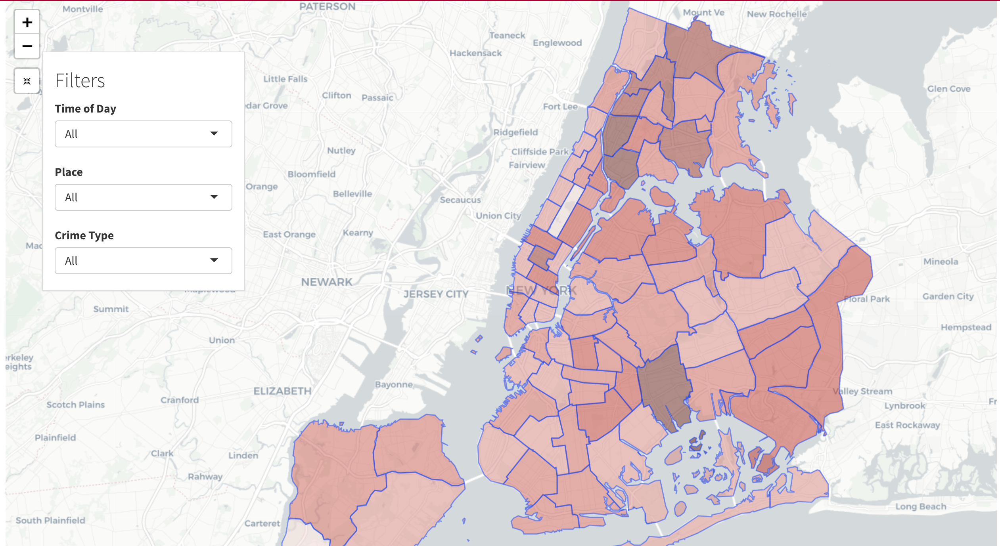

# Project 2: Shiny App Development Version 2.0

### [Project Description](doc/project2_desc.md)



In this second project of GR5243 Applied Data Science, we develop a version 2.0 of an *Exploratory Data Analysis and Visualization* shiny app on NYC Crime Tracking using [NYC Open Data](https://data.cityofnewyork.us/Public-Safety/NYPD-Complaint-Data-Current-Year-To-Date-/5uac-w243) website. See [Project 2 Description](doc/project2_desc.md) for more details.  

The **learning goals** for this project is:

- business intelligence for data science
- study legacy codes and further development
- data cleaning
- data visualization
- systems development/design life cycle
- shiny app/shiny server

*The above general statement about project 2 can be removed once you are finished with your project. It is optional.

## Project Title NYC Crime Tracking
[NYC Crime Tracking ShinyApp](https://samirh47.shinyapps.io/shinyapp6/)
Term: Fall 2019

+ Team 9
+ **Projec title**: + Team members
	+ Dong, Lulu
	+ Gao, Jason
	+ Hadzic, Samir
	+ Song, Mingming

+ **Project summary**: This Shiny app is created for crime tracking on NYC. We used data for 2019 with 222260 records and 77 zones of NYC in total. This data visualization project allows users to explore trends in New York Crime crime trends accross several factors, including geographic variables such as location, borough, and place (i.e. store, street), as well as suspect and victim demographics, and crime type. In this manner the app can serve as a research tool for scholars or city planners. On a more basic level, the app can be used by every day individuals who wish to assess the crime risk of different areas and times, whether it is for their own personal travel, preparation for buying a property, or any other personal task.

+ **Contribution statement**: ([default](doc/a_note_on_contributions.md)) We basically met and worked together on our project. Lulu cleaned data first and others helped to improve depending on their own needs. Lulu and Mingming worked on UI templates and map develop together. Samir made ‘By the Hour' analysis on panel 2 and Jason worked on chances of user facing crimes based on historical data in panel 3. We worked together on debugging and deploying the app. All team members approve our work presented in this GitHub repository including this contributions statement.


Following [suggestions](http://nicercode.github.io/blog/2013-04-05-projects/) by [RICH FITZJOHN](http://nicercode.github.io/about/#Team) (@richfitz). This folder is orgarnized as follows.

```
proj/
├── app/
├── lib/
├── data/
├── doc/
└── output/
```

Please see each subfolder for a README file.

